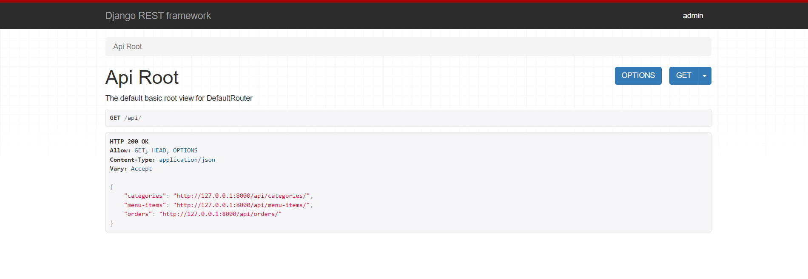
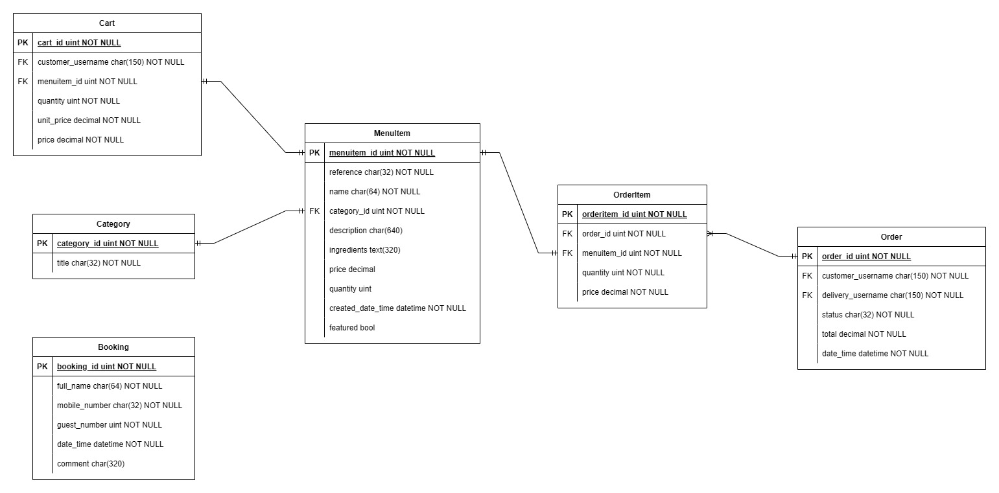

# Little Lemon Restaurant Web Application

## Overview

A web app for the Little Lemon restaurant as per the Meta Backend Developer Course. The user facing web app contains an about page introducing the Little Lemon restaurant, a series of menu item pages describing the dishes available to order, and a booking page for reserving a table at the restaurant.


The web app also includes a REST API for interacting with backend data model. These include the user facing menu items and booking pages described above. The backend api also includes administrative endpoints for controlling users, orders and deliveries.



## Data Model

The underlying data model present in the Little Lemon Restaurant Web App is displayed below. 



For a more detailed account of each column in the dataset see the data dictionary:

* https://github.com/oislen/LittleLemon/blob/main/doc/data_dictionary.xlsx

## Running the Application (Windows)

### Anaconda

Create a local conda environment for the Little Lemon Web app using [anaconda](https://www.anaconda.com/):

```
conda create --name littlelemon python=3.12 --yes
conda activate littlelemon
pip install -r requirements.txt
```

Initialise the Little Lemon Web app sqlite database with preconfigured data and a super user.

```
python manage.py makemigrations restaurant
python manage.py migrate
python manage.py runscript restaurant.import_data
```

Run the django tests and start the Little Lemon Web app using the following commands and the local conda environment:

```
python manage.py test
python manage.py runserver
```

Once the web app is running, navigate to localhost:8000 in your preferred browser

* http://localhost:8000

### Docker

The latest version of the Little Lemon Web App can be found as a [docker](https://www.docker.com/) image on dockerhub here:

* https://hub.docker.com/repository/docker/oislen/littlelemondjango/general

The image can be pulled from dockerhub using the following command:

```
docker pull oislen/littlelemondjango:latest
```

The Little Lemon Web App can then be started using the following command and the docker image:

```
docker run --name llr --net littlelemon --memory 6GB --shm-size=512m -p 8000:8000 --rm oislen/littlelemondjango:latest
```

Once the web app is running, navigate to localhost:8000 in your preferred browser

* http://localhost:8000
