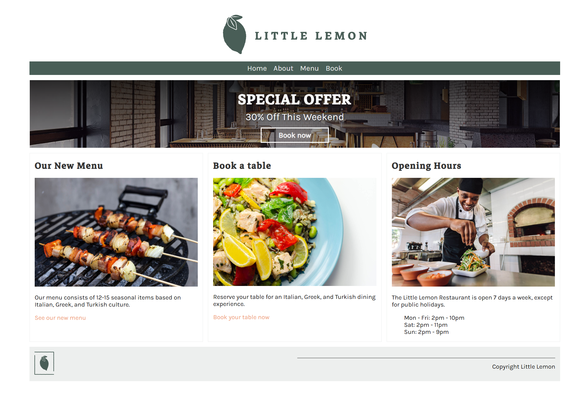
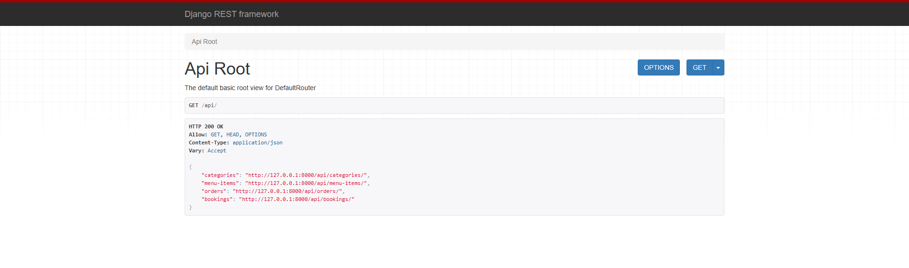

# Overview

A Web-App for the Little Lemon Restaurant as per the Meta Backend Developer Course.



The Web-App also includes a REST API for interacting with backend data model.



# Set-Up

```
cd littlelemon
# make db migrations and import data
python manage.py makemigrations restaurant
python manage.py migrate
python manage.py runscript restaurant.import_data
# create admin super user
python manage.py shell -c "from django.contrib.auth.models import User; User.objects.create_superuser('admin', 'admin@example.com', 'admin')"
# run web-app
python manage.py runserver
```